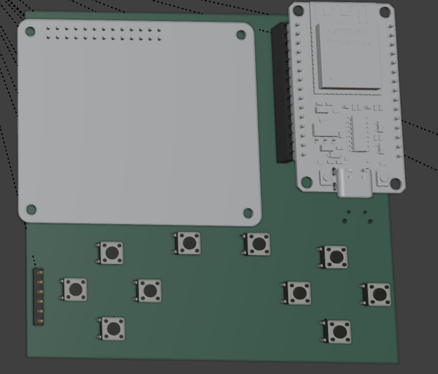

# April 19: Got the raspberry pi screen to work on the esp32!

I first isolated all the pins that were needed to actually power on the lcd as well as looked at the docs (https://www.lcdwiki.com/2.4inch_RPi_Display_For_RPi_3A%2B)

Then i matched the correct pins and used the tft library, and it worked like a charm!!

Heres a picture of it displaying a cat

**Total time spent: 2 hours**

# April 19: Made the schematic for the handheld

This was the first time i used a lot of these components, so i was quite confused, however we made it out alive!

I connected the screen to the esp32, then used an expansion board to wire up all of the buttons to it!

I also decided to add an sd card module to eventually add games to it!

it has 10 normal buttons and 2 trigger style buttons!

**Total time spent: 2.5 hours**

# April 19: Designed the board

I approximated all the measurements since i dont have calipers, but there is enough space for everything to fit properly!

Time to route!!

**Total time spent: 1 hour**

# April 19: Routed the PCB!

This was the first time i had used vias, and they made routing a bit easier, but routing this was still very difficult for me. In the end however, it turned out pretty good and now its time to add a silkscreen!!!

**Total time spent: 4.5 hours**

# April 19: Silkscreen!

I took a few designs from the hc sticker catalogue and added them to the screen! I also put a qr code of my repo there

**Total time spent: 0.5 hours**

# April 19: Final bits of polish -- BOM, Journal and traces

I got all of the parts off of aliexpress and put them into a bom

However the sd card module i was getting was different from the one on my pcb so i had to change it to a different one

I also polished up a few funky looking traces and now im done with the pcb!

Then I made this journal and am now going to make the readme and ship!!

**Total time spent: 1.5 hours**

# April 24: Remade everything to fit in a 100x100mm pcb

This was fun but really annoying since the spacing was really tight, but I feel like it all works now and im glad with the end result. I had to redo it twice though since my first version was like 112mm,which was annoying. I also modelled the screen and found the esp32 model online since i was forced to have in speedrun. I did write this long after since i got really burnt out after some issues with this project so i dont remember everything fully

**Total time spent: 4 hours**
