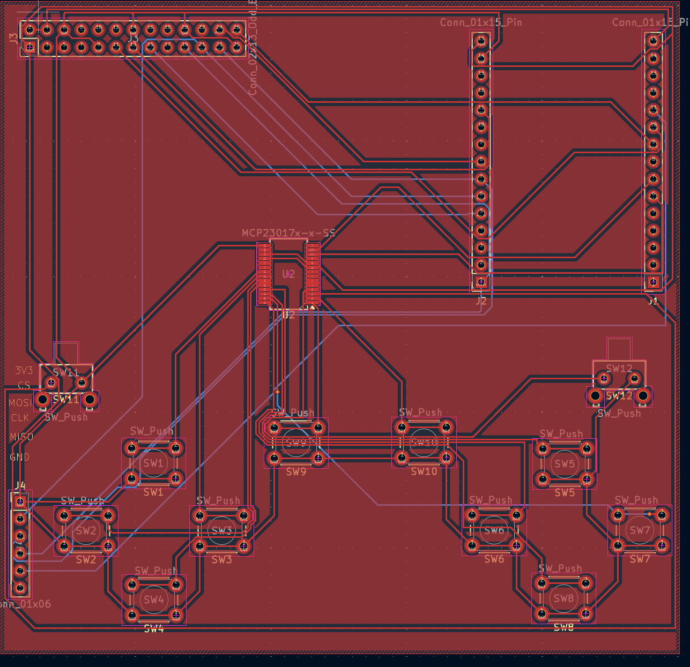

# YouGame!

## What is it? 
YouGame is a handheld device designed for making games using the tft adruino library!

## Features
12 Buttons -- 10 normal push buttons and 2 shoulder trigger style buttons  
320x240 LCD screen  
SD card slot to store the games on an sd card  
ESP32 S3 as the brains  

## Why was this made?  
I mainly decided to do this since I had an old raspberry pi screen that i thought was fried. Since i didn't have my pi on me, I decided to use my esp32 to see if it was. After a while of figuring out which pin goes where, i finally managed to turn on the backlight, and then got images displaying on it! After that i had the idea to turn it into something more than just making it work, so I decided to use it for my second ever hardware project. Along the way I figured out how to use SD card modules, used an expansion board which connects all the buttons together, and learned a lot about hardware all together!  

## Building instructions

Its easiest to start with smallest first, so here is how it will go.  

### Sd card module and triggers
The sd card module and the triggers are going to be under the board, so make sure they are connected the right way round

### MCP2017 Expansion board
Get your soldering iron out because thisll have to be hand soldered

### Headers and buttons  
Headers and buttons are all through hole components so it shouldn't be too challenging to solder them through
## BOM

| Item | Qty | Price (USD) | Link |
|---|---|---|---|
| 2.4" Touch Screen SPI TFT LCD | 1 | $10.24 | [Link](https://www.aliexpress.com/item/1005005770033042.html) |
|2x40 Breakable Pin Header 2.54mm Male (10pcs) | 1 | $2.05 | [Link](https://a.aliexpress.com/_EJZPzXy) |
| Momentary Tactile Push Button 6x6x5 Right Angle (20pcs) | 1 | $1.74 | [Link](https://www.aliexpress.com/item/1005006384754591.html) |
| 12x12mm Panel Tactile Switch, H6.5mm (10pcs) — shoulder buttons | 1 | $1.60 | [Link](https://www.aliexpress.com/item/1005006164609617.html) |
| TF Micro SD Card Module (SPI) | 1 | $0.90 | [Link](https://www.aliexpress.com/item/1005005302035188.html) |
| Female Pin Header Socket Gold Plated 15-Pin (10pcs) | 1 | $3.70 | [Link](https://www.aliexpress.com/item/1005003610333849.html) |
| ESP32 WiFi Bluetooth Dev Board Type-C CH340 | 1 | $5.59 | [Link](https://www.aliexpress.com/item/1005008771142129.html) |
| PCB fabrication | 1 | $11.45 | jlcbcp.com  |
| MCP2017-SS expansion baord | 1 | 1.84 | https://www.aliexpress.com/item/1005010450787157.html?mp=1 |

**Total:** $39.1
