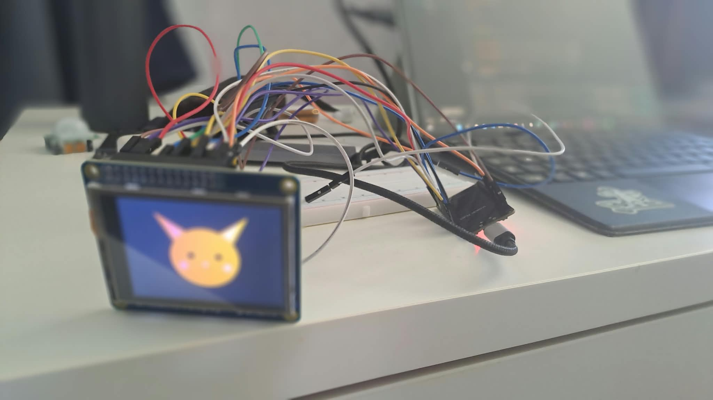
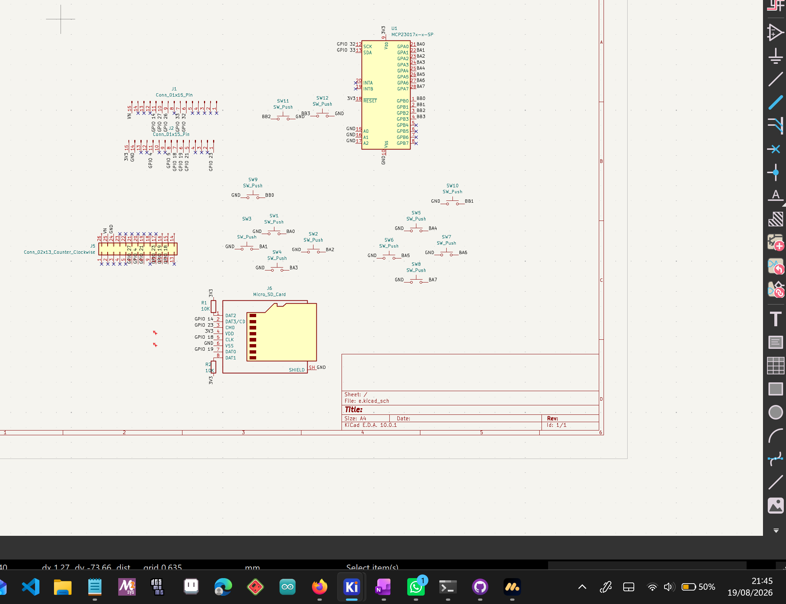
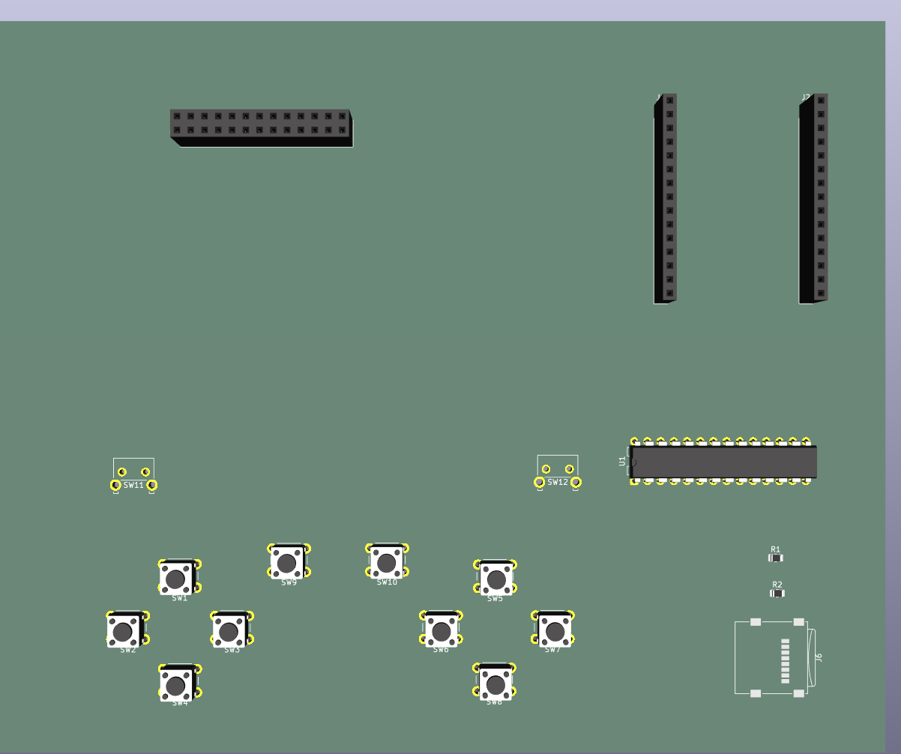
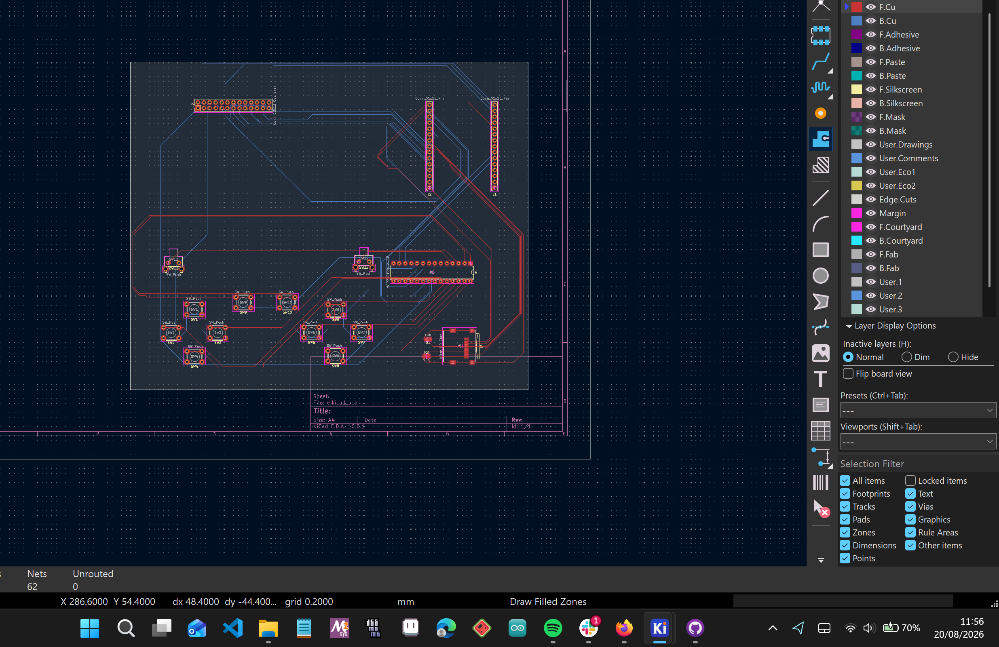
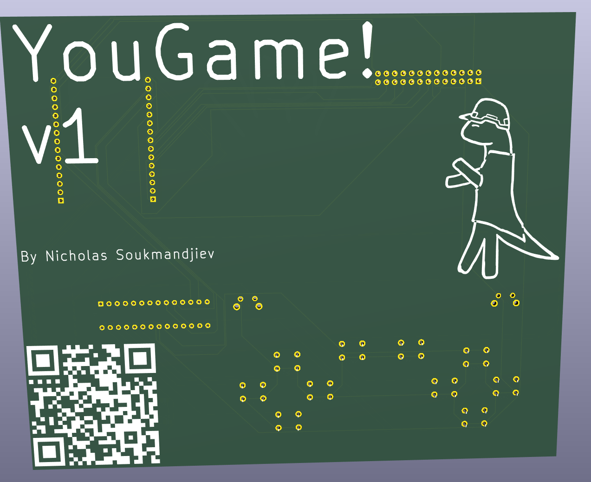
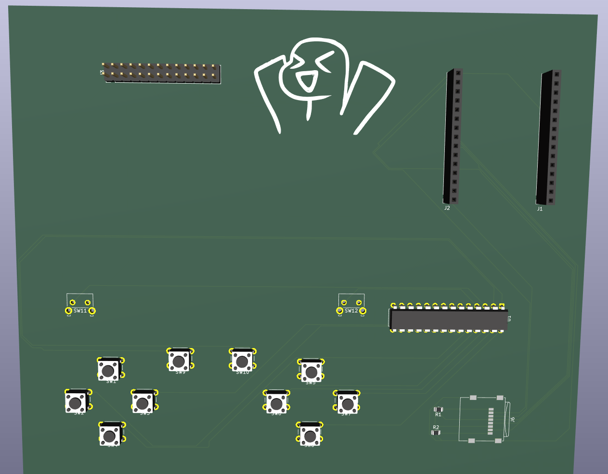
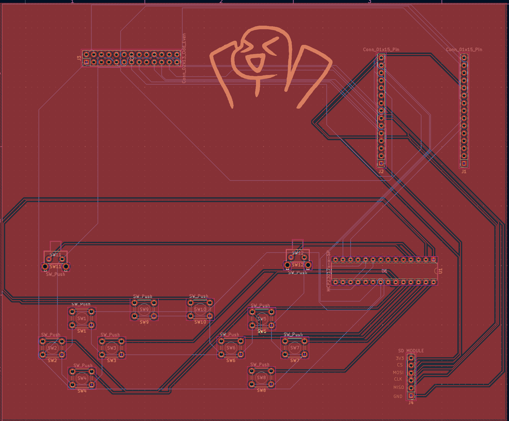
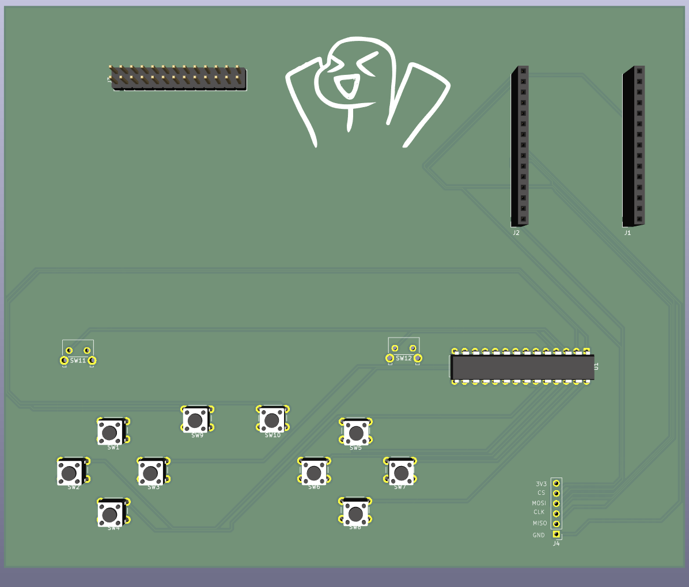
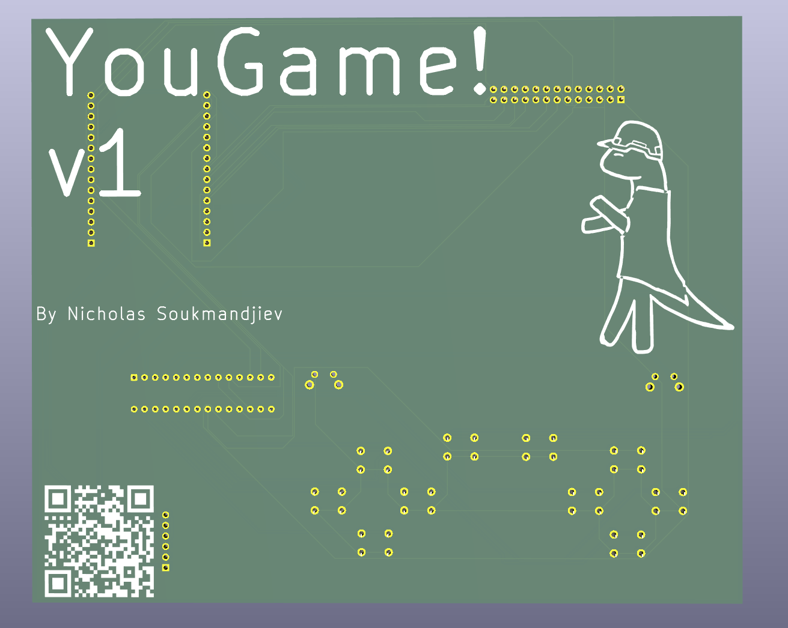

# 1 Got the raspberry pi screen to work on the esp32! - 2hrs
> 19th April 15:18 

I first isolated all the pins that were needed to actually power on the lcd as well as looked at the docs (https://www.lcdwiki.com/2.4inch_RPi_Display_For_RPi_3A%2B)

Then i matched the correct pins and used the tft library, and it worked like a charm!!

Heres a picture of it displaying a cat

# 2 Made the schematic for the handheld -2.5hrs

This was the first time i used a lot of these components, so i was quite confused, however we made it out alive!

I connected the screen to the esp32, then used an expansion board to wire up all of the buttons to it!

I also decided to add an sd card module to eventually add games to it!

it has 10 normal buttons and 2 trigger style buttons!

# 3 Designed the board - 1hr
> 19th April 22:31
I approximated all the measurements since i dont have calipers, but there is enough space for everything to fit properly!

Time to route!!

# 4 Routed the PCB! - 4.5hrs
>19th april 11:56

This was the first time i had used vias, and they made routing a bit easier, but routing this was still very difficult for me. In the end however, it turned out pretty good and now its time to add a silkscreen!!!

# 5 Silkscreen! - 0.5hrs
>19th april 13:08

I took a few designs from the hc sticker catalogue and added them to the screen! I also put a qr code of my repo there

# 6 Final bits of polish -- BOM, Journal and traces- 1.5hrs
>19th april 15:44

I got all of the parts off of aliexpress and put them into a bom

However the sd card module i was getting was different from the one on my pcb so i had to change it to a different one

I also polished up a few funky looking traces and now im done with the pcb!

Then I made this journal and am now going to make the readme and ship!!

